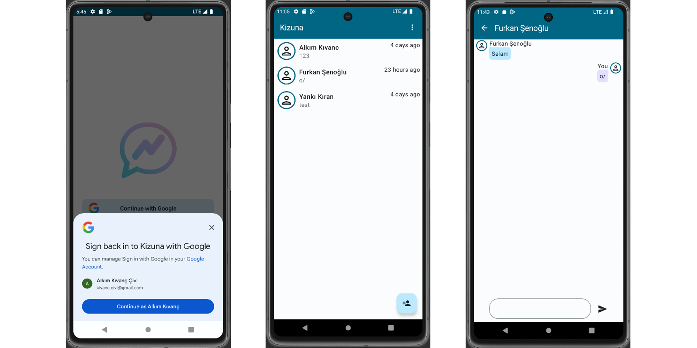
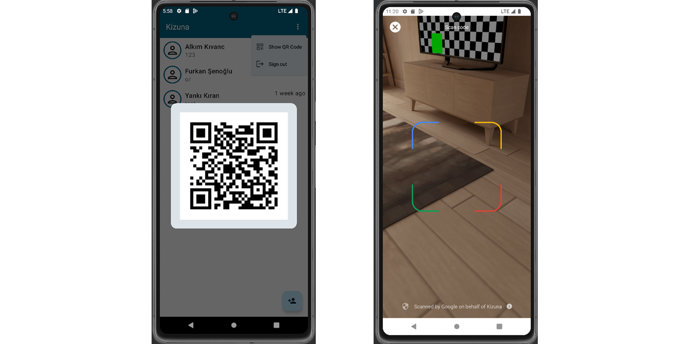

# Kizuna
Messaging app for Android. Built using Compose, Firebase, Ktor, PostgreSQL.

Backend: [github.com/vonkez/kizuna-backend](https://github.com/vonkez/kizuna-backend)

## Features
- Google One Tap Sign-In
- Live messaging
- New contact using QR Code

## Images
 
